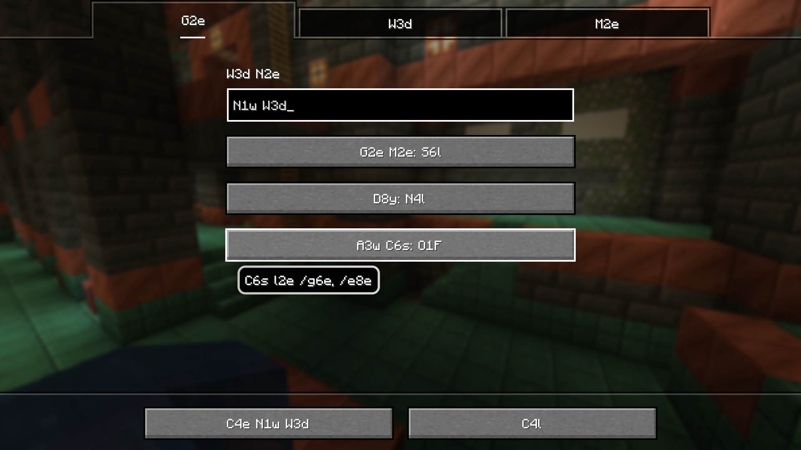
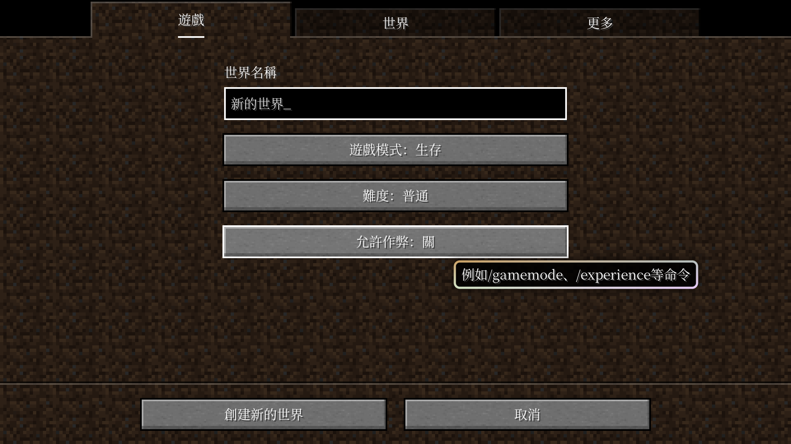
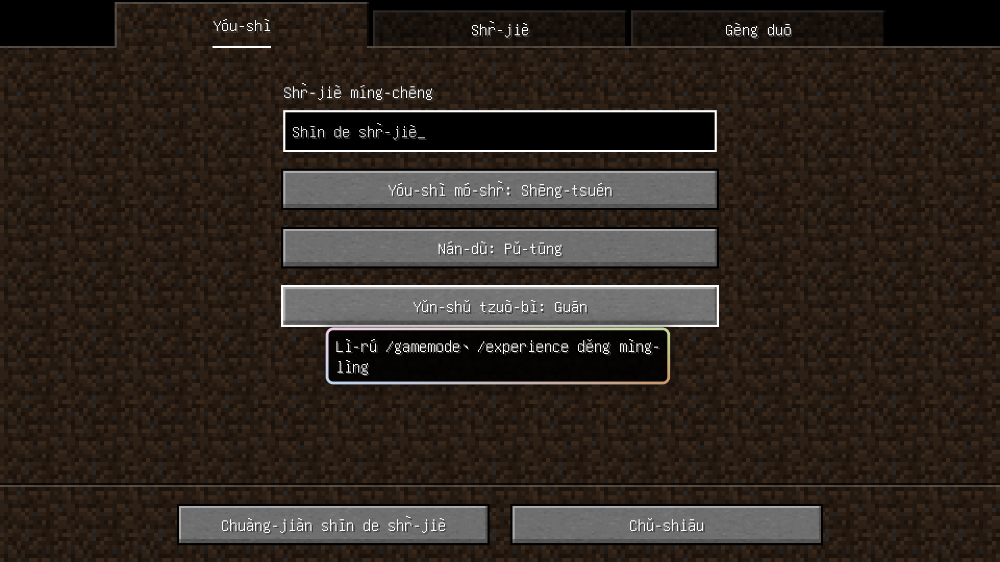
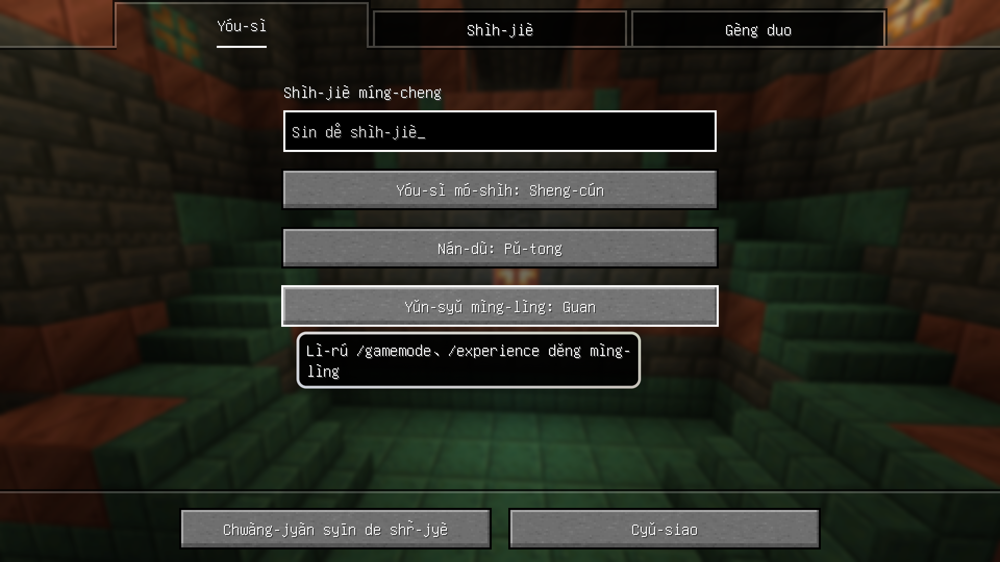
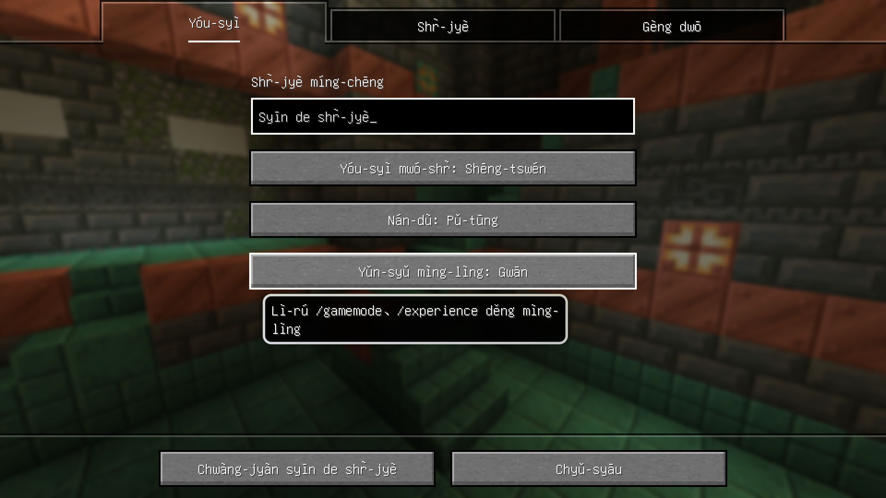
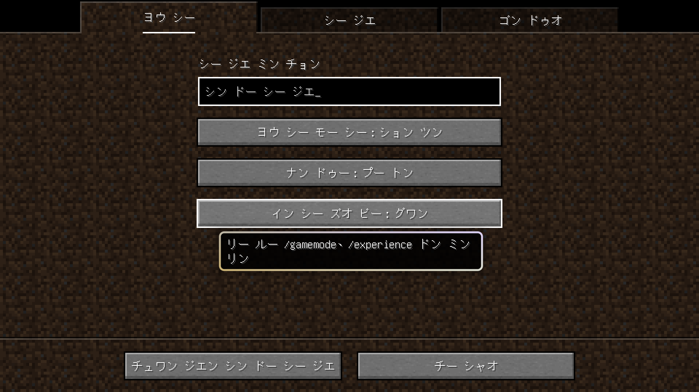

# Minecraft难视语言资源包

[](https://github.com/SkyEye-FAST/unreadable_language_pack/actions/workflows/update.yml) [](https://github.com/SkyEye-FAST/unreadable_language_pack/actions/workflows/pylint.yml)

- **[English](README_en.md) | [中文](README.md)**

----

此项目用于提供将Minecraft Java版语言文件的源字符串转写为片假名和万叶假名，并将简体中文转写为汉语拼音、注音符号及IPA的资源包。

请使用模组[Modern UI](https://modrinth.com/mod/modern-ui)让游戏支持现代字体特性来保证所有字符正常显示。

推荐与模组[Language Reload](https://modrinth.com/mod/language-reload)和[Untranslated Items](https://www.curseforge.com/minecraft/mc-mods/untranslated-items)一同使用。

## 下载

- [**下载最新版本资源包**](https://github.com/SkyEye-FAST/unreadable_language_pack/releases/latest/download/unreadable_language_pack.zip)
- [查看历史版本](https://github.com/SkyEye-FAST/unreadable_language_pack/releases/)

> [!TIP]
> 由于1.19.2之后所有版本的语言文件都可以通用，不一定需要选择对应版本的标签，选择最新版本即可。

## 说明

### 依赖项

请使用下面的命令安装依赖项：

``` shell
pip install -r requirements.txt
```

### 获取语言文件

本仓库会在每天🕧00:30（UTC+8，即🕟UTC 16:30）自动检查Minecraft Java版语言文件（`en_us.json`、`zh_cn.json`）更新并更新资源包。

### 资源包

资源包使用[`pack.py`](pack.py)生成。脚本生成的语言文件存储在与脚本同级的`output`文件夹下，同[`pack.mcmeta`](pack.mcmeta)和[`pack.png`](pack.png)一同打包为`unreadable_language_pack.zip`。

资源包向游戏内添加了15种语言。

> [!TIP]
> 本项目使用的中文转写对照表参见下两表：
>
> [`comparison_table_1.tsv`](table/comparison_table_1.tsv)（带声调，注音方案）
>
> [`comparison_table_2.tsv`](table/comparison_table_2.tsv)（不带声调，外文转写）

#### i18nglish (i7h)（[`en_i7h.json`](output/en_i7h.json)）

- 选择之后，所有字符串会变为保留英文单词的首尾字符，中间用字符数替代的缩写。长度为2或以下的单词保持不变。

#### エングリスホ (カタカナ)（[`ja_kk.json`](output/ja_kk.json)）

- 即“English (Katakana)”。
- 选择之后，所有字符串会变为英文转写而来的片假名。

> [!WARNING]
> 英文转写至片假名使用了[KotRikD/romajitable](https://github.com/KotRikD/romajitable)的映射，这不是正确的音译方式，**可能和英文的真实读音相差甚大**。**请不要将转写结果用于娱乐场景外的地方。**
>
> 转写结果中修复了“Lena Raine”和“Samuel Åberg”的转写，并保留了“C418”。

#### 江尓具利須保 (万葉仮名)（[`ja_my.json`](output/ja_my.json)）

- 即“English (Man'yōgana)”。
- 选择之后，所有字符串会变为英文转写而来的万叶假名。为保证生成结果不偏差过大，仅选择万叶假名多种可能中的某一种。

#### 繁體中文 (中國大陸)（[`zh_hm.json`](output/zh_hm.json)）

- 即“繁体中文 (中国大陆)”。
- 选择之后，所有字符串会变为简体中文按GB/Z 40637-2021和《通用规范汉字表》转换而来的繁体中文。

> [!NOTE]
> 简繁转换使用了库`opencc`和[forFudan/GujiCC](https://github.com/forFudan/GujiCC)的“调和大陆繁体标准”。
>
> 汉字对应关系基本上来自GB/Z 40637-2021，少部分以《通用规范汉字表》的对应关系覆盖。

#### Hànyǔ Pīnyīn (Zhōngguó Dàlù)（[`zh_py.json`](output/zh_py.json)）

- 即“汉语拼音 (中国大陆)”。
- 选择之后，所有字符串会变为简体中文转写而来的汉语拼音，以词为单位。
  - 尝试遵循了GB/T 16159-2012的正词法要求。

> [!IMPORTANT]
> 汉字标音使用了库`pypinyin`和`pypinyin_dict`，补充了[cc_cedict.org](https://cc-cedict.org/)的数据，并手动添加了某些词语的读音。原则上，读音以普通话音系为准。其他根据发音转写的方案都基于此项的数据。
>
> 中文分词使用了库`jieba`，配置了词库并进行了替换修正。
>
> 虽然经过处理，但结果仍然无法保证完全符合GB/T 16159-2012的要求。应加连接号的地方尚未有合适的方法满足要求。
>
> “一”“不”等变调按照GB/T 16159-2012要求不标出。
>
> **由于没有经过完整的人工审核，不能保证长文本的分词准确性。**

#### Chinese in IPA (t͡ʂʊŋ˥ kwo˧˥ ta˥˩ lu˥˩)（[`zh_ipa.json`](output/zh_ipa.json)）

- 即“国际音标转写 (中国大陆)”。
- 选择之后，所有字符串会变为简体中文转写而来的IPA。

> [!NOTE]
> IPA转写方案来自[@UntPhesoca](https://www.zhihu.com/people/UntW)所写文章[新老派普通话的宽严式记音（含儿化韵）](https://zhuanlan.zhihu.com/p/38258415)中的宽式标音。轻声作不标出处理。

#### ㄓㄨˋ ㄧㄣ ㄈㄨˊ ㄏㄠˋ (ㄓㄨㄥ ㄍㄨㄛˊ ㄉㄚˋ ㄌㄨˋ)（[`zh_bpmf.json`](output/zh_bpmf.json)）

- 即“注音符号 (中国大陆)”。
- 选择之后，所有字符串会变为简体中文转写而来的注音符号。

#### Wade–Giles (Chung¹-Kuo² Ta⁴-Lu⁴)（[`zh_wg.json`](output/zh_wg.json)）

- 即“威妥玛拼音 (中国大陆)”。
- 选择之后，所有字符串会变为简体中文转写而来的威妥玛拼音。

#### Gwoyeu Romatzyh (Jonggwo Dahluh)（[`zh_gr.json`](output/zh_gr.json)）

- 即“国语罗马字 (中国大陆)”。
- 选择之后，所有字符串会变为简体中文转写而来的国语罗马字。

#### Jù-yīn Fú-hàu Dì-èr Shr̀ (Jūng-guó Dà-lù)（[`zh_mps2.json`](output/zh_mps2.json)）

- 即“注音符号第二式 (中国大陆)”。
- 选择之后，所有字符串会变为简体中文转写而来的注音符号第二式。

#### Tong-yòng Pin-yin (Jhong-guó Dà-lù)（[`zh_ty.json`](output/zh_ty.json)）

- 即“通用拼音 (中国大陆)”。
- 选择之后，所有字符串会变为简体中文转写而来的通用拼音。

#### Yale romanization (Jūng-gwó Dà-lù)（[`zh_yale.json`](output/zh_yale.json)）

- 即“耶鲁拼音 (中国大陆)”。
- 选择之后，所有字符串会变为简体中文转写而来的耶鲁拼音。

#### カタカナ (ジョン グオ ダー ルー)（[`zh_kk.json`](output/zh_kk.json)）

- 即“片假名 (中国大陆)”。
- 选择之后，所有字符串会变为简体中文转写而来的片假名。

#### Палладицу (Чжунго далу)（[`zh_cy.json`](output/zh_cy.json)）

- 即“西里尔化中文 (中国大陆)”。
- 选择之后，所有字符串会变为西里尔化的简体中文。

#### ثِیَوْعَرݣ‌ٍْ (جْو‌قُوَ دَا‌لُ)（[`zh_xj.json`](output/zh_xj.json)）

- 即“小儿经 (中国大陆)”。
- 选择之后，所有字符串会变为简体中文转写而来的小儿经。













## 反馈

遇到的问题和功能建议等可以提出议题（Issue）。

欢迎创建拉取请求（Pull request）。
