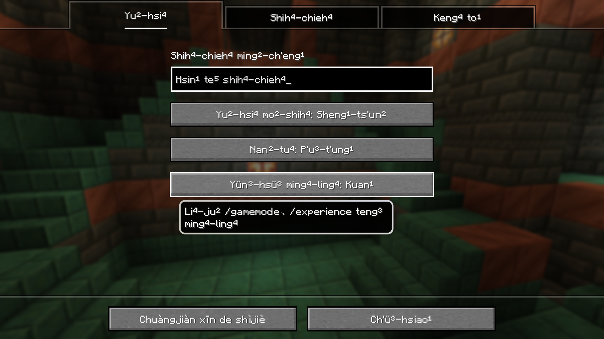
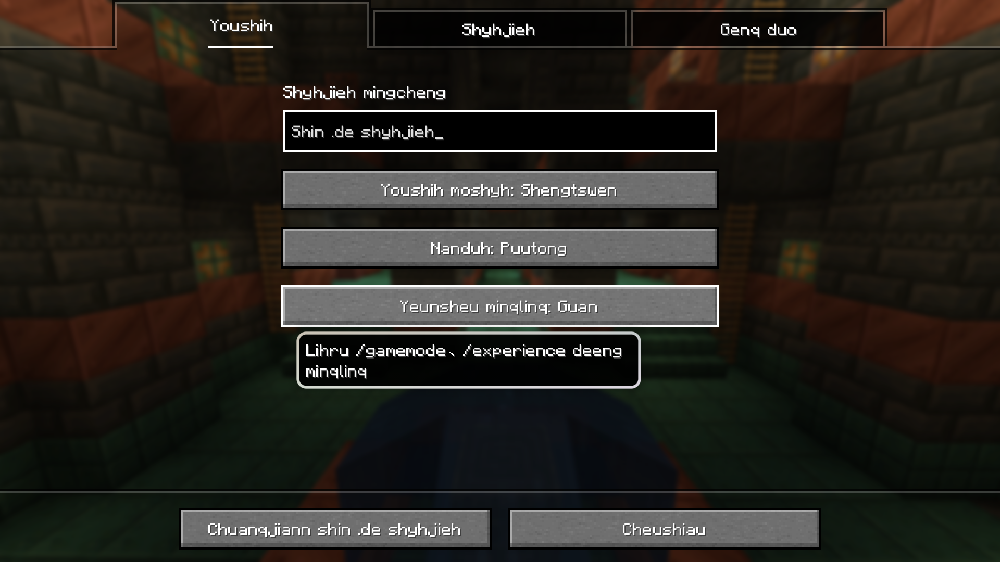
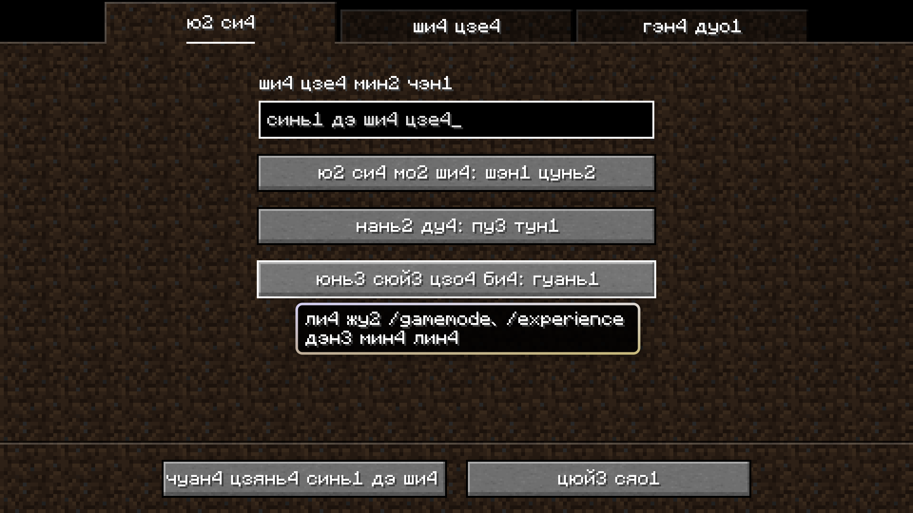
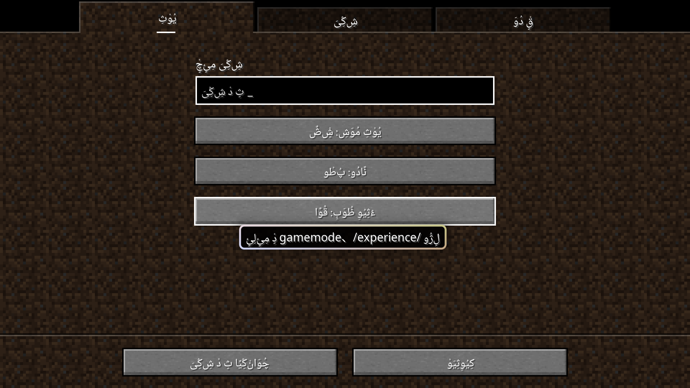

# Minecraft Unreadable Language Resource Pack

- **[English](README_en.md) | [中文](README.md)**

----

This project provides a resource package that converts the source strings of Minecraft: Java Edition language files into Katakanas and Man'yōganas, and converts Simplified Chinese into Pinyin, Bopomofo and IPA.

Please use the mod [Modern UI](https://modrinth.com/mod/modern-ui) to make the game support modern font features to ensure that all characters are displayed normally.

It is recommended to use this resource pack with the mods [Language Reload](https://modrinth.com/mod/language-reload) and [Untranslated Items](https://www.curseforge.com/minecraft/mc-mods/untranslated-items).

## Description

## Dependencies

Install dependencies using the following command:

``` shell
pip install -r requirements.txt
```

### Obtaining Language Files

This repository automatically checks for updates to Minecraft: Java Edition language file (`en_us.json`, `zh_cn.json`) every day at 🕧00:30 (UTC+8, equivalent to 🕟UTC 16:30) and updates the resource pack accordingly. This is done using the script [`source.py`](source.py). The obtained language files are stored in the `source` folder, which is at the same level as the script.

### Resource Pack

The resource pack is generated using [`pack.py`](pack.py). The language files generated by the script are stored in the `output` folder, which are packed together with [`pack.mcmeta`](pack.mcmeta) into `unreadable_language_pack.zip`.

The resource pack added 9 languages into the game:

- **"エングリスホ (カタカナ)"** ([`ja_kk.json`](output/ja_kk.json))
  - i.e. "English (Katakana)".
  - Once selected, all strings will be changed to Katakana transliterated from English.
- **"江尓具利須保 (万葉仮名)"** ([`ja_my.json`](output/ja_my.json))
  - i.e. "English (Man'yōgana)".
  - Once selected, all character strings will be converted into Man'yōganas transliterated from English. In order to ensure that the generated results do not deviate too much, only one of the many possibilities of Man'yōganas is selected.

> [!WARNING]
> English transliteration to katakana uses the mapping of [KotRikD/romajitable](https://github.com/KotRikD/romajitable). This is not a correct translation method and **may be very different from the real pronunciation in English**. **Please do not use the transliteration results outside of entertainment scenarios.**
>
> Transliterations of "Lena Raine" and "Samuel Åberg" will be fixed and "C418" will be retained in the results.

- **"Hànyǔ Pīnyīn (Zhōngguó Dàlù)"** ([`zh_pyw.json`](output/zh_pyw.json))
  - i.e. "Pinyin (Chinese mainland)".
  - Once selected, all strings will be changed to Pinyin transliterated from Simp. Chinese, in units of words, and try to comply with GB/T 16159-2012.

> [!IMPORTANT]
> Transliteration of Chinese uses the libraries `pypinyin` and `pypinyin_dict`, supplements the data of [cc_cedict.org](https://cc-cedict.org/), and manually adds the pronunciation of some words.
>
> In principle, the pronunciation is based on the Putonghua phonetic system.
>
> The word segmentation of Chinese uses the library `jieba`, with configurations of the dictionaries and corrections.
>
> Although processed, the results are still not guaranteed to fully comply with the requirements of GB/T 16159-2012. Where dashes should be added, there is no suitable method to meet the requirements.
>
> Tone sandhi (such as "一" and "不") won't be marked according to the requirements of GB/T 16159-2012.
>
> **Due to the lack of complete manual review, the word segmentation accuracy of long texts cannot be guaranteed.**

- **"Chinese in IPA (t͡ʂʊŋ˥ kwo˧˥ ta˥˩ lu˥˩)"** ([`zh_ipa.json`](output/zh_ipa.json))
  - i.e. “Chinese in IPA (Chinese mainland)”.
  - Once selected, all strings will be changed to IPA transliterated from Simp. Chinese.

> [!NOTE]
> The IPA transliteration scheme comes from the article [新老派普通话的宽严式记音（含儿化韵）](https://zhuanlan.zhihu.com/p/38258415) written by [@UntPhesoca](https://www.zhihu.com/people/UntW). Neutral tones won't be marked.

- **"ㄓㄨˋ ㄧㄣ ㄈㄨˊ ㄏㄠˋ (ㄓㄨㄥ ㄍㄨㄛˊ ㄉㄚˋ ㄌㄨˋ)"** ([`zh_bpmf.json`](output/zh_bpmf.json))
  - i.e. "Bopomofo (Chinese mainland)”.
  - Once selected, all strings will be changed to Bopomofo transliterated from Simp. Chinese.
- **"Wade–Giles (Chung¹-Kuo² Ta⁴-Lu⁴)"** ([`zh_wg.json`](output/zh_wg.json))
  - i.e. "Wade–Giles (Chinese mainland)”.
  - Once selected, all strings will be changed to Wade–Giles transliterated from Simp. Chinese.
- **"Gwoyeu Romatzyh (Jonggwo Dahluh)"** ([`zh_gr.json`](output/zh_gr.json))
  - i.e. "Gwoyeu Romatzyh (Chinese mainland)”.
  - Once selected, all strings will be changed to Gwoyeu Romatzyh transliterated from Simp. Chinese.
- **"Палладицу (Чжунго далу)"** ([`zh_cy.json`](output/zh_cy.json))
  - i.e. "Palladitsa (Chinese mainland)”.
  - Once selected, all strings will be changed to Cyrillized Simp. Chinese.
- **"ثِیَوْعَرݣ‌ٍْ (جْو‌قُوَ دَا‌لُ)"** （[`zh_xj.json`](output/zh_xj.json)）
  - i.e. "Xiao'erjing (Chinese mainland)”.
  - Once selected, all strings will be changed to Xiao'erjing transliterated from Simp. Chinese.







## Feedback

Please feel free to raise issues for any problems encountered or feature suggestions.

Pull requests are welcome.
