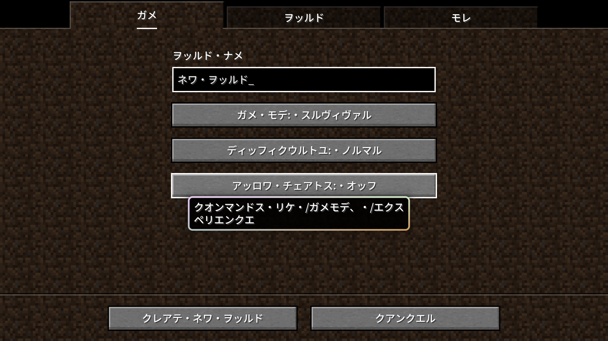
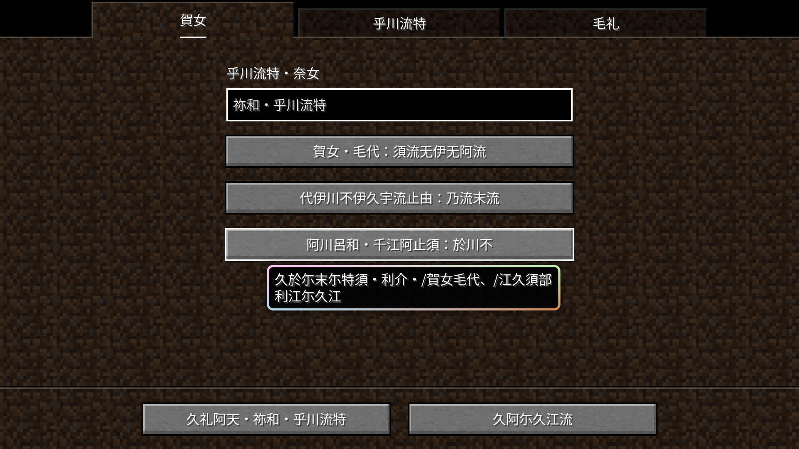
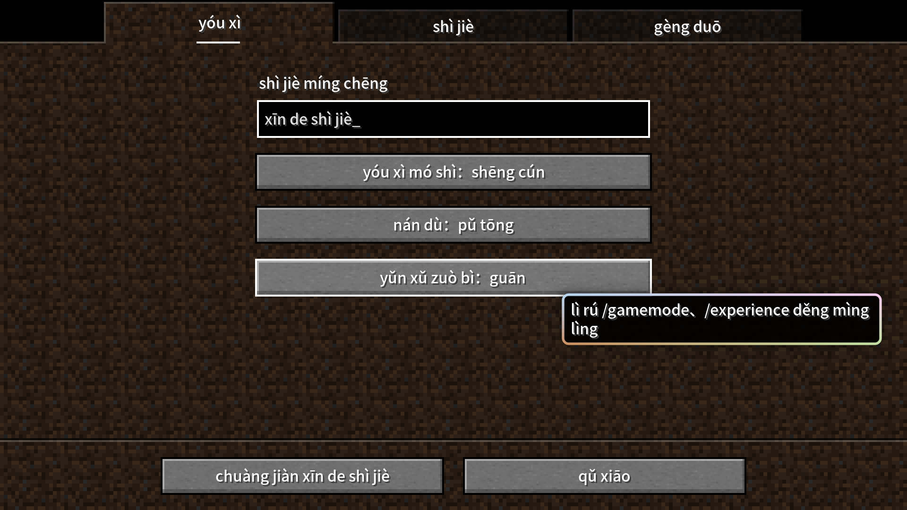
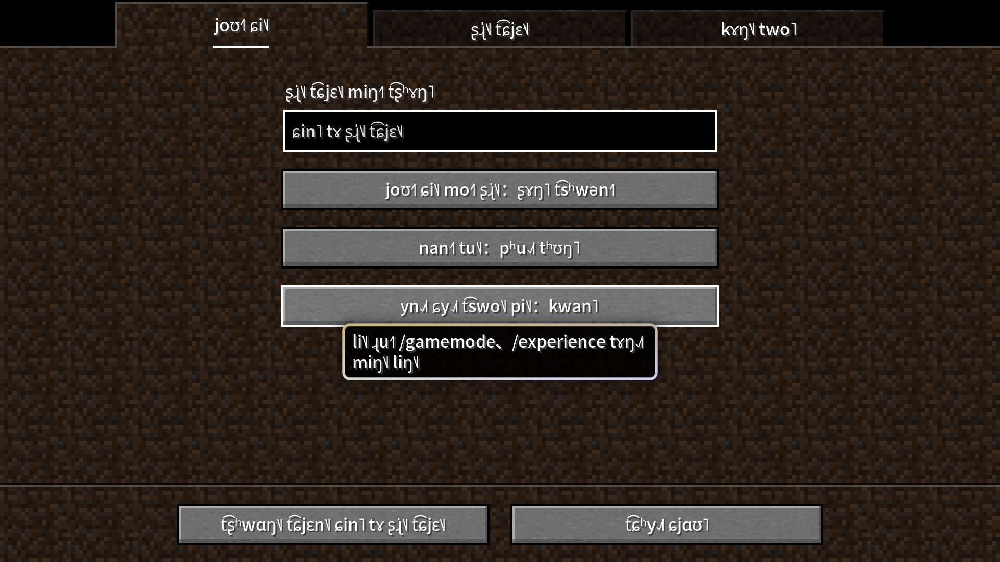

# Minecraft Unreadable Language Resource Pack

- **[English](README_en.md) | [中文](README.md)**

----

This project provides a resource package that converts the source strings of Minecraft: Java Edition language files into Katakanas and Man'yōganas, and converts Simplified Chinese into Chinese Pinyin, Bopomofo and IPA.

Please use the mod [Modern UI](https://modrinth.com/mod/modern-ui) to make the game support modern font features to ensure that all characters are displayed normally.

It is recommended to use this resource pack with the mods [Language Reload](https://modrinth.com/mod/language-reload) and [Untranslated Items](https://www.curseforge.com/minecraft/mc-mods/untranslated-items).

## Description

## Dependencies

Install dependencies using the following command:

``` shell
pip install -r requirements.txt
```

### Obtaining Language Files

This repository automatically checks for updates to Minecraft: Java Edition language file (`en_us.json`, `zh_cn.json`) every day at 🕧00:30 (UTC+8, equivalent to 🕟UTC 16:30) and updates the resource pack accordingly. This is done using the script [`source.py`](source.py). The obtained language files are stored in the `source` folder, which is at the same level as the script.

### Resource Pack

The resource pack is generated using [`pack.py`](pack.py). The language files generated by the script are [`ja_kk.json`](ja_kk.json), [`ja_my.json`](ja_my.json), [`zh_py.json`](zh_py.json), [`zh_pyw.json`](zh_pyw.json) and [`zh_ipa.json`](zh_ipa.json), which are packed together with [`pack.mcmeta`](pack.mcmeta) into `unreadable_language_pack.zip`.

The resource pack added 6 languages into the game:

- **"エングリスホ (カタカナ)"**
  - i.e. "English (Katakana)".
  - Once selected, all strings will be changed to Katakana transliterated from English.
- **"依尓愚煎須百 (万葉仮名)"**
  - i.e. "English (Man'yōgana)".
  - Once selected, all character strings will be converted into Man'yōganas translated from English. In order to ensure that the generated results do not deviate too much, only one of the many possibilities of Man'yōganas is selected.
- **"pīn yīn jiǎn tǐ zhōng wén (char, zhōng guó dà lù)"**
  - i.e. "Pinyin Simplified Chinese (per character, Chinese mainland)".
  - Once selected, all strings will be changed to Chinese Pinyin transliterated from Simp. Chinese, in units of characters.
- **"pīn yīn jiǎn tǐ zhōng wén (word, zhōng guó dà lù)"**
  - i.e. "Pinyin Simplified Chinese (per word, Chinese mainland)".
  - Once selected, all strings will be changed to Chinese Pinyin transliterated from Simp. Chinese, in units of words, and try to comply with GB/T 16159-2012.
- **"t͡ɕjɛn˨˩˦ tʰi˨˩˦ t͡ʂʊŋ˥ wən˧ IPA (t͡ʂʊŋ˥ kwo˧˥ ta˥˩ lu˥˩)"**
  - i.e. “IPA Simplified Chinese (Chinese mainland)”.
  - Once selected, all strings will be changed to IPA transliterated from Simp. Chinese.
- **"ㄓㄨˋ ㄧㄣ ㄐㄧㄢˇ ㄊㄧˇ ㄓㄨㄥ ㄨㄣˊ (ㄓㄨㄥ ㄍㄨㄛˊ ㄉㄚˋ ㄌㄨˋ)"**
  - i.e. "Bopomofo Simplified Chinese (Chinese mainland)”.
  - Once selected, all strings will be changed to Bopomofo transliterated from Simp. Chinese.







## Feedback

Please feel free to raise issues for any problems encountered or feature suggestions.

Pull requests are welcome.
