# Minecraft Unreadable Language Resource Pack

[](https://github.com/SkyEye-FAST/unreadable_language_pack/actions/workflows/update.yml) [](https://github.com/SkyEye-FAST/unreadable_language_pack/actions/workflows/checks.yml)

- **[English](README_en.md) | [中文](README.md)**

---

This project provides a Minecraft: Java Edition resource pack which contains new non-standard "languages" converted from existing languages. See the section [#Resource Pack](#resource-pack) for more information.

Please use the mod [Modern UI](https://modrinth.com/mod/modern-ui) to make the game support modern font features to ensure that all characters are displayed normally.

It is recommended to use this resource pack with the mods [Language Reload](https://modrinth.com/mod/language-reload) and [Untranslated Items](https://www.curseforge.com/minecraft/mc-mods/untranslated-items).

## Download

- [**Download the latest version**](https://github.com/SkyEye-FAST/unreadable_language_pack/releases/latest/download/unreadable_language_pack.zip)
- [View previous versions](https://github.com/SkyEye-FAST/unreadable_language_pack/releases/)

> [!TIP]
> Since all versions of language files after 1.19.2 can be used universally, you do not necessarily need to select the tag of the corresponding version, just select the latest version.

## Description

## Dependencies

The project uses Python 3.12+ and [uv](https://docs.astral.sh/uv/) for dependency management. After cloning the repository with its submodules, run:

```shell
uv sync --locked --dev
uv run language-pack build
```

Run tests and code-quality checks with:

```shell
uv run pytest
uv run ruff check .
uv run ruff format --check .
```

### Obtaining Language Files

This repository automatically checks for updates to Minecraft: Java Edition language file (`en_us.json`, `zh_cn.json`) every day at 🕧00:30 (UTC+8, equivalent to 🕟UTC 16:30) and updates the resource pack accordingly.

### Resource Pack

Run `uv run language-pack build` to generate the resource pack. Generated language files are stored in `output` and packed with [`pack.mcmeta`](pack.mcmeta) and [`pack.png`](pack.png) into `unreadable_language_pack.zip`. ZIP member order and timestamps are fixed, so identical inputs produce an identical archive.

The resource pack added 15 languages into the game.

> [!TIP]
> The Chinese transcription comparison table used in this project is shown in the following two tables:
>
> [`comparison_table_1.tsv`](table/comparison_table_1.tsv) (with tones, phonetic notation scheme)
>
> [`comparison_table_2.tsv`](table/comparison_table_2.tsv) (without tones, foreign language transcription)
>
> The table may contain syllables that do not exist in Putonghua, such as lüan, etc., for reference only.
>
> The table omits the transliterations of ㆭ (ng, /ŋ̍/), ㆬ (m, /m̩/), ㄯ (n, /n̩/), ㄏㆬ (hm, /xm̩/), and ㄏㆭ (hng, /xŋ̍/). Most schemes do not specify how they should be spelled, and these syllables are not actually used in this project.

#### "i18nglish (i7h)" ([`en_i7h.json`](output/en_i7h.json))

- Once selected, all strings will be changed to abbreviations with the first and last characters of the English word retained and the number of characters in the middle replaced. Words with a length of 2 or less will remain unchanged.

#### "エングリスホ (カタカナ)" ([`ja_kk.json`](output/ja_kk.json))

- i.e. "English (Katakana)".
- Once selected, all strings will be changed to Katakana transliterated from English.

> [!WARNING]
> English transliteration to katakana uses the mapping of [KotRikD/romajitable](https://github.com/KotRikD/romajitable). This is not a correct translation method and **may be very different from the real pronunciation in English**. **Please do not use the transliteration results outside of entertainment scenarios.**
>
> Transliterations of "Lena Raine" and "Samuel Åberg" will be fixed and "C418" will be retained in the results.

#### "江尓具利須保 (万葉仮名)" ([`ja_my.json`](output/ja_my.json))

- i.e. "English (Man'yōgana)".
- Once selected, all character strings will be converted into Man'yōganas transliterated from English. In order to ensure that the generated results do not deviate too much, only one of the many possibilities of Man'yōganas is selected.

#### "Hànyǔ Pīnyīn (Zhōngguó Dàlù)" ([`zh_py.json`](output/zh_py.json))

- i.e. "Pinyin (Chinese mainland)".
- Once selected, all strings will be changed to Pinyin transliterated from Simp. Chinese, in units of words.
  - Reviewed against the current recommended national standard, [GB/T 16159-2012, Basic Rules of the Chinese Phonetic Alphabet Orthography](https://openstd.samr.gov.cn/bzgk/std/newGbInfo?hcno=5645BD8DB9D8D73053AD3A2397E15E74). The [full text published by the Ministry of Education](https://www.moe.gov.cn/ewebeditor/uploadfile/2015/01/13/20150113091717604.pdf) is linked for clause-level reference.

> [!IMPORTANT]
> Chinese pronunciation uses `pypinyin` and `pypinyin-dict`, supplemented with [CC-CEDICT](https://cc-cedict.org/) and project-level phrase pronunciations from `data/phrases.json`. Dictionaries load in the order base data → CC-CEDICT/di → project corrections. A space in a phrase key marks an exact adjacent-word context, such as `结果 的`. Every Mandarin pronunciation-based scheme uses this data.
>
> Chinese word segmentation uses `jieba` and `data/dict.txt`, with manually reviewed Minecraft word boundaries in `data/word_splits.json`. Every Chinese-derived scheme shares pronunciation selection, word boundaries, and protection of Minecraft technical tokens, but not Hanyu Pinyin punctuation, capitalization, or tone-marking rules. Other schemes preserve source punctuation and use their own spelling, tone, and delimiter rules.
>
> Hanyu Pinyin output uses word-based spacing and applies the relevant grammatical and lexicalized boundaries, ordinal hyphens, syllable-separating apostrophes, sentence and title-first-word capitalization, unmarked neutral tones, and the lexical tones of “一” and “不”. For example, “不是” is written `bù shì`, not the surface-tone teaching form `bú shì`. Minecraft formatting codes, placeholders, commands, and program syntax are protected first. See [`docs/hanyu-pinyin-orthography.md`](docs/hanyu-pinyin-orthography.md) for the complete reading notes and project decisions.
>
> “Reviewed against the standard” is not a claim of formal certification. Automatic segmentation cannot infer every grammatical relation, proper noun, idiom structure, or polyphonic reading from context. The project maintains only vocabulary and corrections required by actual Minecraft language entries. Corrections should be added to `data/phrases.json`, `data/dict.txt`, `data/word_splits.json`, or the language-key fix data instead of adding unrelated general vocabulary or hard-coded language keys.

#### "Chinese in IPA (t͡ʂʊŋ˥ kwo˧˥ ta˥˩ lu˥˩)" ([`zh_ipa.json`](output/zh_ipa.json))

- i.e. “Chinese in IPA (Chinese mainland)”.
- Once selected, all strings will be changed to IPA transliterated from Simp. Chinese.

> [!NOTE]
> The IPA transliteration scheme comes from the article [新老派普通话的宽严式记音（含儿化韵）](https://zhuanlan.zhihu.com/p/38258415) written by [@UntPhesoca](https://www.zhihu.com/people/UntW). Neutral tones won't be marked.

#### "ㄓㄨˋ ㄧㄣ ㄈㄨˊ ㄏㄠˋ (ㄓㄨㄥ ㄍㄨㄛˊ ㄉㄚˋ ㄌㄨˋ)" ([`zh_bpmf.json`](output/zh_bpmf.json))

- i.e. "Bopomofo (Chinese mainland)”.
- Once selected, all strings will be changed to Bopomofo transliterated from Simp. Chinese.

#### "Wade–Giles (Chung¹-Kuo² Ta⁴-Lu⁴)" ([`zh_wg.json`](output/zh_wg.json))

- i.e. "Wade–Giles (Chinese mainland)”.
- Once selected, all strings will be changed to Wade–Giles transliterated from Simp. Chinese.

#### "Gwoyeu Romatzyh (Jonggwo Dahluh)" ([`zh_gr.json`](output/zh_gr.json))

- i.e. "Gwoyeu Romatzyh (Chinese mainland)”.
- Once selected, all strings will be changed to Gwoyeu Romatzyh transliterated from Simp. Chinese.

#### "Jiaanhuah Guoryuu Romatzyh (JJungguor Dahluh)" ([`zh_sgr.json`](output/zh_sgr.json))

- i.e. "Simplified Guoryuu Romatzyh (Chinese mainland)”.
- Once selected, all strings will be changed to Simp. Guoryuu Romatzyh transliterated from Simp. Chinese.

#### "Jù-yīn Fú-hàu Dì-èr Shr̀ (Jūng-guó Dà-lù)" ([`zh_mps2.json`](output/zh_mps2.json))

- i.e. "Mandarin Phonetic Symbols II (Chinese mainland)”.
- Once selected, all strings will be changed to Mandarin Phonetic Symbols II transliterated from Simp. Chinese.

#### "Tongyong Pinyin (Jhong-guó Dà-lù)" ([`zh_ty.json`](output/zh_ty.json))

- i.e. "Tongyong Pinyin (Chinese mainland)”.
- Once selected, all strings will be changed to Tongyong Pinyin transliterated from Simp. Chinese.

#### "Yale romanization (Jūng-gwó Dà-lù)" ([`zh_yale.json`](output/zh_yale.json))

- i.e. "Yale romanization (Chinese mainland)”.
- Once selected, all strings will be changed to Yale romanization transliterated from Simp. Chinese.

#### "カタカナ (ジョン グオ ダー ルー)" ([`zh_kk.json`](output/zh_kk.json))

- i.e. "Katakana (Chinese mainland)”.
- Once selected, all strings will be changed to Katakana transliterated from Simp. Chinese.

#### "Палладицу (Чжунго далу)" ([`zh_cy.json`](output/zh_cy.json))

- i.e. "Palladitsa (Chinese mainland)”.
- Once selected, all strings will be changed to the Cyrillic script transliterated from Simp. Chinese, according to the Palladius system.

#### "ثِیَوْعَرݣ‌ٍْ (جْو‌قُوَ دَا‌لُ)" ([`zh_xj.json`](output/zh_xj.json))

- i.e. "Xiao'erjing (Chinese mainland)”.
- Once selected, all strings will be changed to Xiao'erjing transliterated from Simp. Chinese.

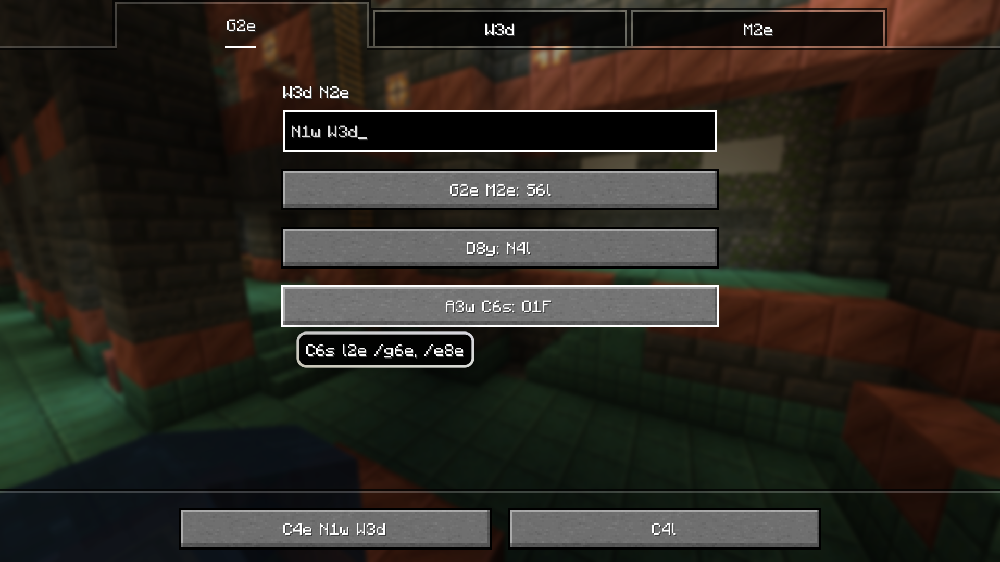
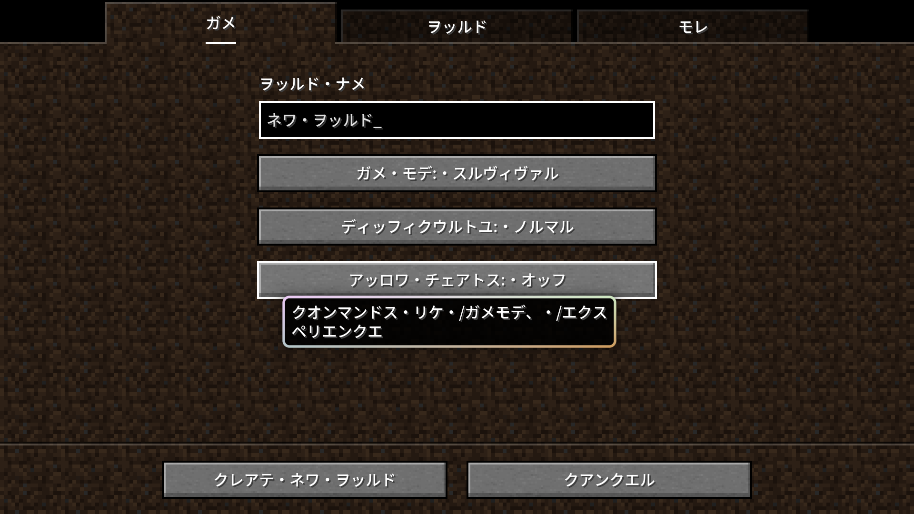
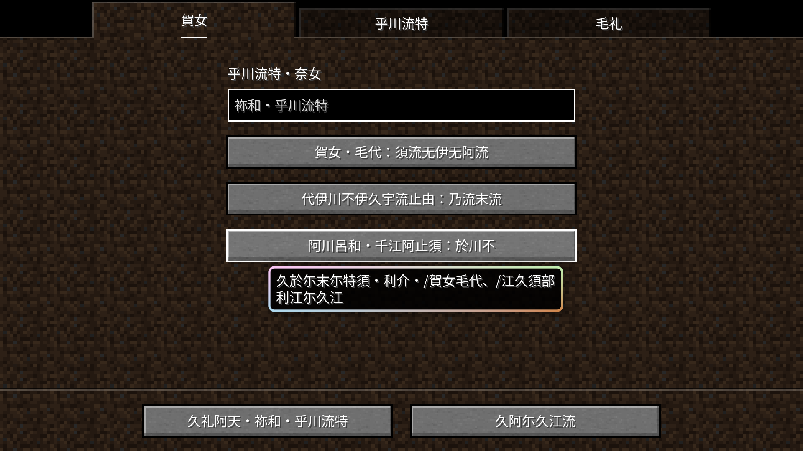
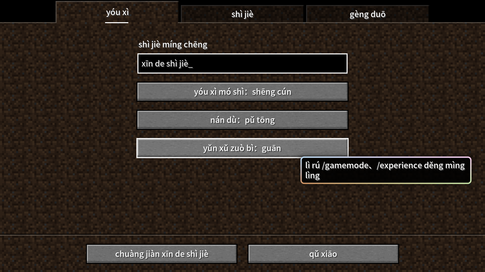
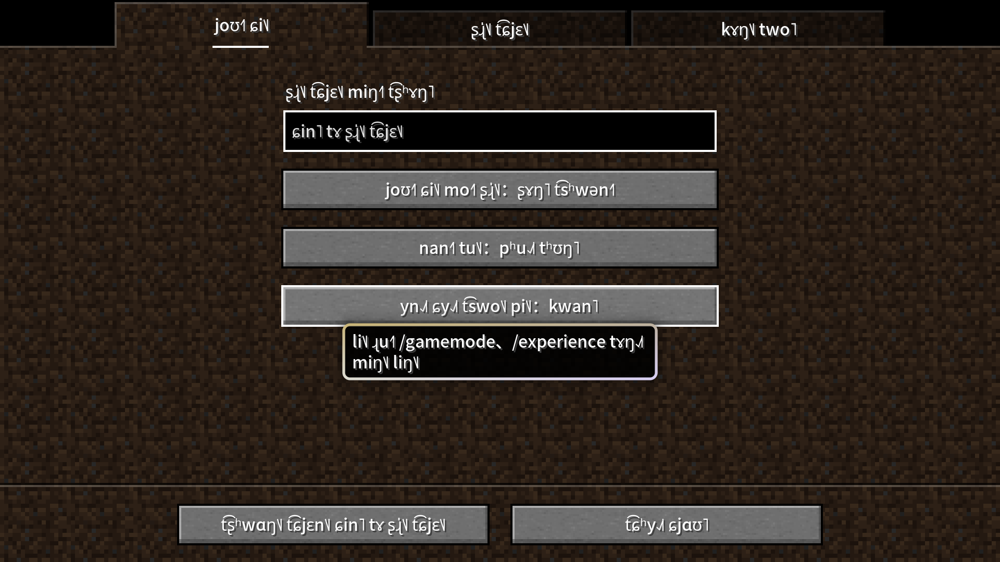
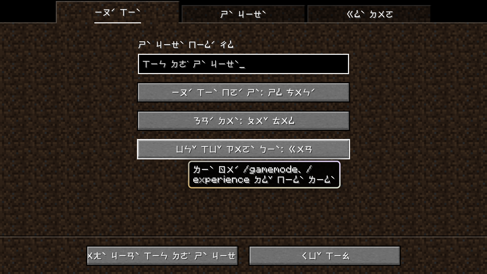
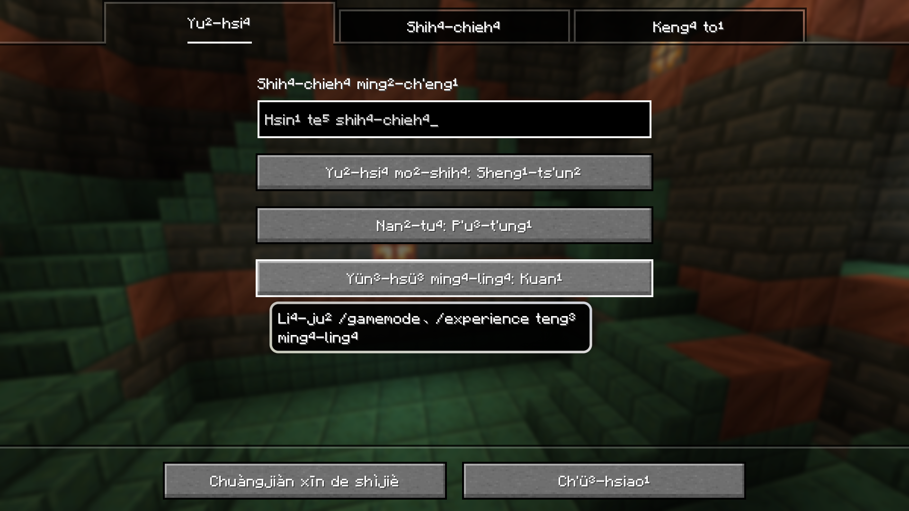
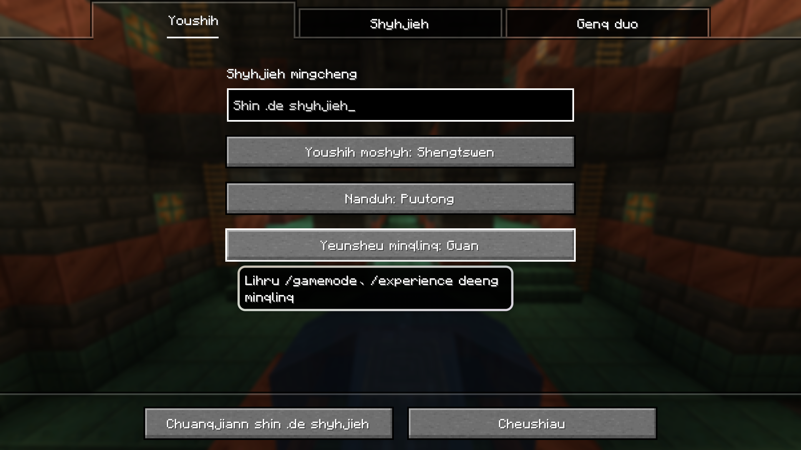
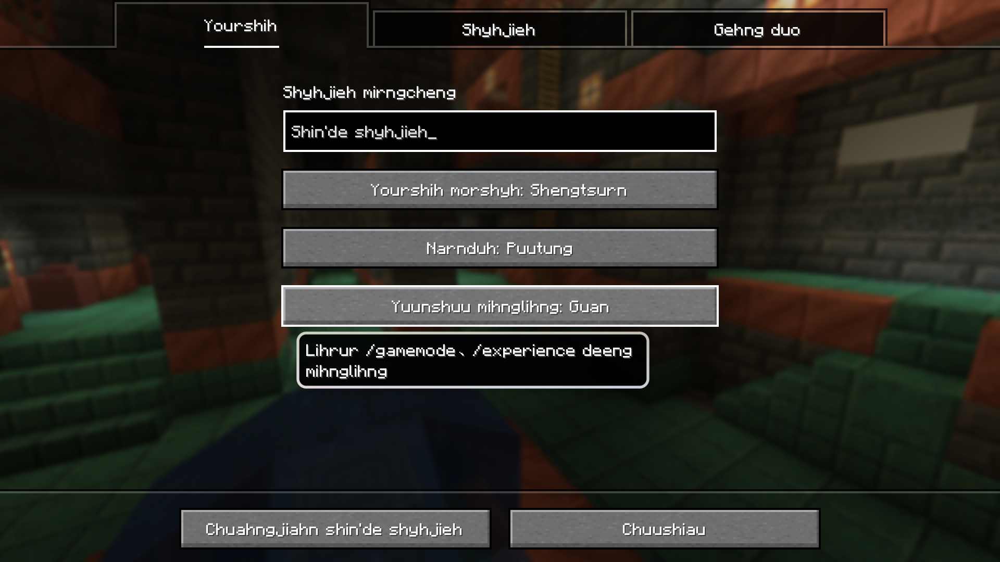
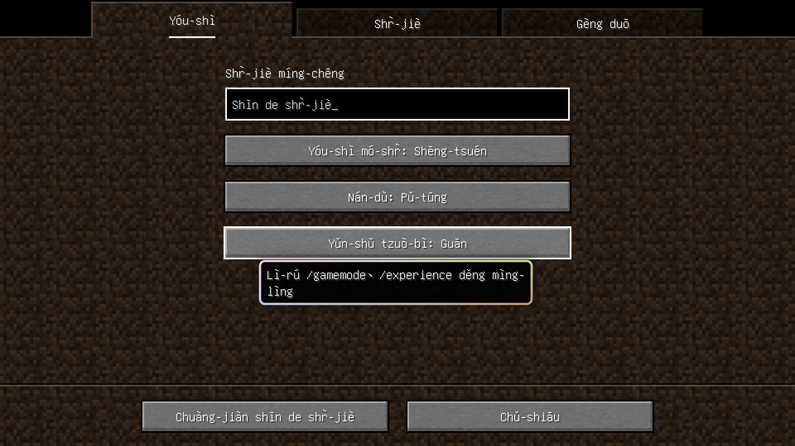
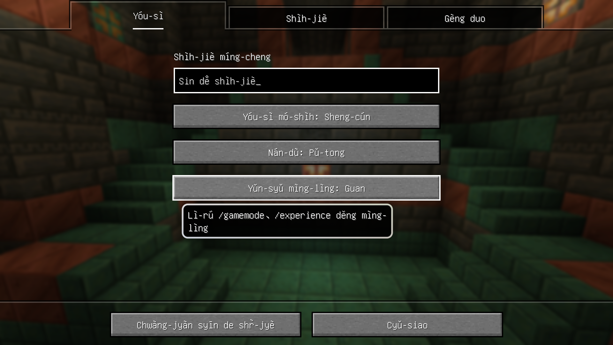
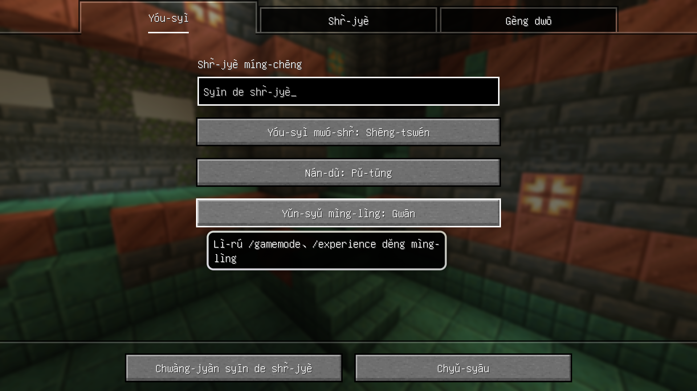
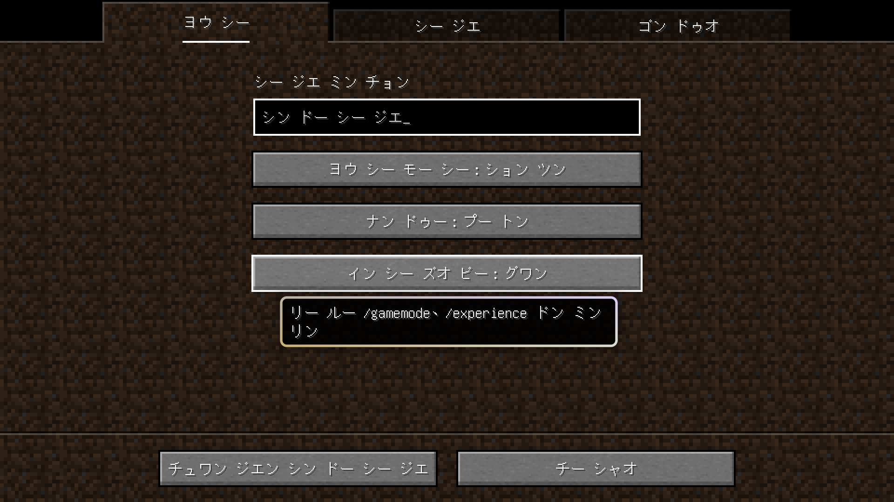
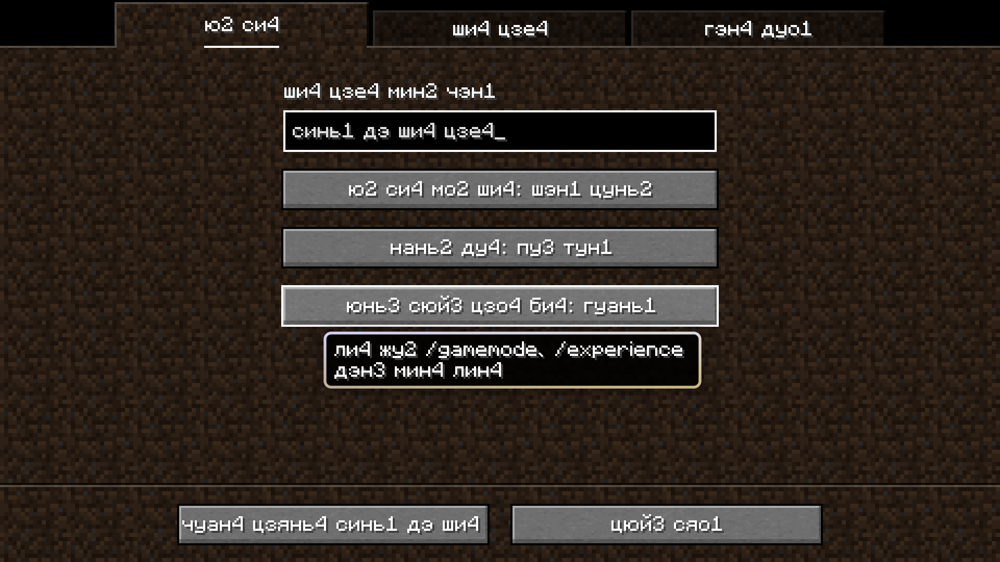
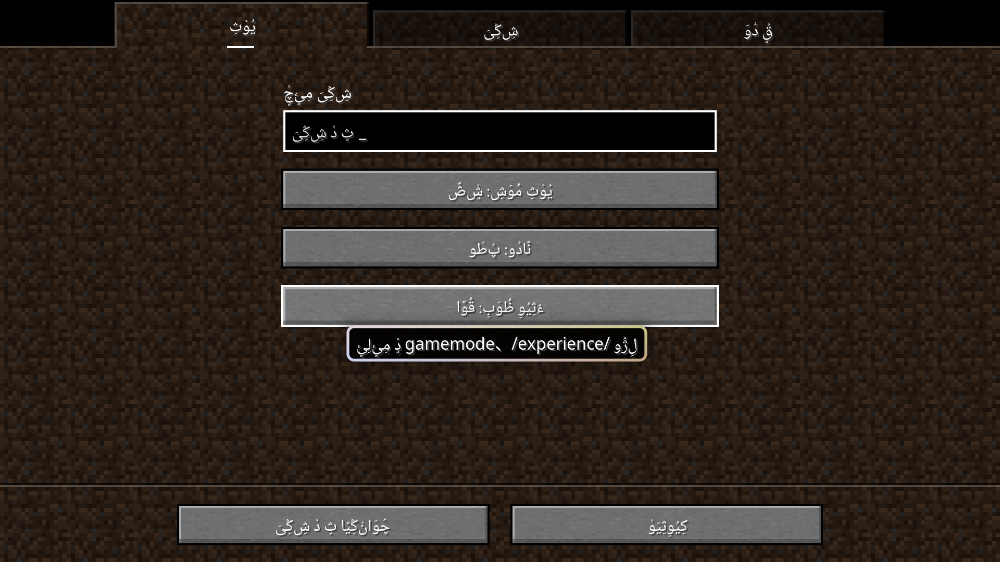

## License

The resource pack is released under the [Apache 2.0 license](LICENSE).

```text
  Copyright 2024-2025 SkyEye_FAST

  Licensed under the Apache License, Version 2.0 (the "License");
  you may not use this file except in compliance with the License.
  You may obtain a copy of the License at

      http://www.apache.org/licenses/LICENSE-2.0

  Unless required by applicable law or agreed to in writing, software
  distributed under the License is distributed on an "AS IS" BASIS,
  WITHOUT WARRANTIES OR CONDITIONS OF ANY KIND, either express or implied.
  See the License for the specific language governing permissions and
  limitations under the License.
```

## Feedback

Please feel free to raise issues for any problems encountered or feature suggestions.

Pull requests are welcome.
